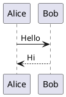

# C4 Diagrams with PlantUML

## When to use this skill

Use this skill when you need to:
- Create C4 context/container/component/code diagrams in PlantUML
- Capture actors, systems, containers, and their relationships for an architecture view
- Ask for or refine inputs like primary actors, system boundaries, key containers, and data flows
- Maintain diagrams in `$REPO_ROOT/docs/diagrams` by default. You may ask the
  user if she wants to have a `./diagrams/` folder directly next to some other
  files.
  
## Overview

For a code repository, a user may ask to create and tune architectural diagrams
using **C4-PlantUML**. [C4 documentation](https://c4model.com/) C4 is a developer-friendly method
for visualizing software architecture through four hierarchical levels of
abstraction: Context, Container, Component, and Code. This approach
progressively adds detail, starting with a high-level overview of the system's
interactions and zooming into finer-grained components to communicate design
clearly. PlantUML is an open-source tool that allows users to create various
types of diagrams, including UML diagrams, from simple plain-text descriptions.

[C4-PlantUML](https://github.com/plantuml-stdlib/C4-PlantUML/blob/master/README.md) is a tool that combines the benefits of PlantUML and the C4
model. This skill covers includes, elements, relationships, and layout control
(global direction, forced edge direction, and element arrangement).

## Repo conventions

When used inside a repository:
- Store diagram sources in `$REPO_ROOT/docs/diagrams` only. Alternatively, us a
  `./diagrams/` folder directly next to some other files, if the user wants it
  that way.
- Subfolders are allowed and encouraged for scoping, e.g. `$REPO_ROOT/docs/diagrams/subsystem`.
- After creating or updating a `.puml` file, run `scripts/render.sh` on it to
  keep the output updated.
- For C4 sets, always generate an explorer HTML page with
  `scripts/build_explorer.sh` so context/container/component (and optional
  deployment/sequence) can be explored on one page.
- When a user asks for diagrams, always render a PNG by default as part of the
  response; treat rendering as implicit (do not ask separately).
- Honor user requests for SVG in addition to the default PNG.

## Default deliverables for C4 sets

When creating a C4 set, produce these artifacts by default:
- Individual rendered diagrams for:
  - System Landscape (if provided)
  - System Context
  - Container
  - Component
  - Deployment (if provided)
  - Sequence (if provided)
- One interactive explorer HTML page that can switch between all available
  views and collapse/expand sections.

Use this naming convention:
- `<basename>-landscape.(svg|png)` (optional)
- `<basename>-context.(svg|png)`
- `<basename>-container.(svg|png)`
- `<basename>-component.(svg|png)`
- `<basename>-deployment.(svg|png)` (optional)
- `<basename>-sequence.(svg|png)` (optional)
- `<basename>-c4-explorer.html`

## Always render, always validate

When using the skill, always remember:
- Always render a diagram to PNG after any edits. Make sure diagrams are always
  up to date.
- Once rendered, review the diagram visually using your built-in image viewer
  to validate that the request of the user has been adhered to, especially
  regarding layout:
  - it should be preferably landscape
  - no overlapping text labels

## C4

### Core ideas

* **Goal:** communicate software architecture at *multiple zoom levels* with
  consistent, simple shapes.
* **Elements:** **Person**, **Software System**, **Container**, **Component**
  (+ **Code** level is optional).
* **Relationships:** directed connections with a short verb phrase (what talks
  to what, and why).

### Diagram levels & intent

* **System Landscape (optional):** where your system sits among other systems
  and user types.
* **Level 1 — System Context:** who uses the system and which neighboring systems it
  exchanges data with. *Scope:* one software system.
* **Level 2 — Container:** high-level building blocks (apps, services, UIs, DBs, queues)
  inside the system and their responsibilities/tech. *Scope:* deployable/runtime units.
* **Level 3 — Component:** internals of a single container: components (cohesive
  units—modules, services, controllers) and their dependencies. *Scope:* design boundaries
  within a container.
* **Level 4 — Code (optional):** selected classes/functions to illustrate a pattern.
  *Scope:* only when it clarifies.

### Element types

* **Person:** human actor (user or role). *Intent:* who benefits or initiates interactions.
* **Software System:** major system (the thing you’re building or external). *Intent:* sets
  the boundary for the other levels.
* **Container:** deployable/runtime unit (service, SPA, mobile app, DB, message broker).
  *Intent:* responsibilities + technology + interface.
* **Component:** cohesive chunk inside a container (e.g., “PaymentService,”
  “OrderController”). *Intent:* purpose + interface; hides implementation details.

### Relationships (edges)

* **Direction:** A → B (caller → callee / data flow direction).
* **Label:** short verb + purpose (e.g., “reads from,” “publishes events to”).
* **Tech/Protocol (optional):** HTTP/JSON, gRPC, JDBC, AMQP, etc.
* **Notes:** security constraints, sync/async, rate/volume if useful.

### Notation guidelines

* **Name + short description** on every box.
* **Responsibilities** over implementation detail.
* **Technology** on containers (and components if clarifying).
* **Boundaries:** group related elements (system boundary; container scope).
* **Keep it legible:** few boxes/lines per view; create more views instead of clutter.

### Supporting views (often used)

* **Dynamic diagram (scenario):** sequence of calls across elements for a use case.
* **Deployment diagram:** nodes (environments, VMs, k8s, serverless) and which containers
  run where.

## PlantUML

**PlantUML** is a text-based diagramming tool. Diagrams are written as plain
text and rendered into images (SVG, PNG, PDF). This makes diagrams easy to
version, review, and generate automatically.

### Why PlantUML
- **Version control friendly** (plain text)
- **Fast to write and modify**
- **Automatable** (CLI, CI/CD, Docker)
- **Wide diagram support**

### Supported diagram types
- Sequence diagrams
- Class diagrams
- Component and deployment diagrams
- Activity diagrams
- State diagrams
- C4-style architecture diagrams
- Mind maps and more

### Basic example




## Compile .puml files to SVG, PDF, PNGs 

In the `scripts/` folder of this skill, there is a convenience wrapper
`scripts/render.sh` to run it either locally or via Docker.

You can convert a PlantUML file to a raster or vector format as follows:

```bash
cat assets/simple.puml | scripts/render.sh -tpng -pipe > simple.png
``` 

```bash
cat assets/simple.puml | scripts/render.sh -tsvg -pipe > simple.svg
```

## Interactive Explorer Output

Use `scripts/build_explorer.sh` to produce a one-page C4 explorer:

```bash
scripts/build_explorer.sh \
  --out docs/diagrams/payments-c4-explorer.html \
  --title "Payments Architecture C4" \
  --readme README.md \
  --landscape docs/diagrams/payments-landscape.svg \
  --context docs/diagrams/payments-context.svg \
  --container docs/diagrams/payments-container.svg \
  --component docs/diagrams/payments-component.svg \
  --deployment docs/diagrams/payments-deployment.svg \
  --sequence docs/diagrams/payments-sequence.svg
```

Behavior:
- `--context`, `--container`, and `--component` are required and must exist.
- `README.md` is read by default and the first meaningful paragraph is shown at
  the top as a short system description. Override with `--readme <path>`.
- `--landscape`, `--deployment`, and `--sequence` are optional; missing
  optional files are omitted from the page.
- The page includes top switch buttons and collapsible sections. Opening one
  section collapses the others.
- Clicking a diagram opens it in a fullscreen viewer; close with Escape,
  backdrop click, or the close button.
- Prefer SVG inputs when available; use PNG otherwise.

### End-to-end example (landscape + 5 views + explorer)

```bash
cat docs/diagrams/payments-landscape.puml | scripts/render.sh -tsvg -pipe > docs/diagrams/payments-landscape.svg
cat docs/diagrams/payments-context.puml | scripts/render.sh -tsvg -pipe > docs/diagrams/payments-context.svg
cat docs/diagrams/payments-container.puml | scripts/render.sh -tsvg -pipe > docs/diagrams/payments-container.svg
cat docs/diagrams/payments-component.puml | scripts/render.sh -tsvg -pipe > docs/diagrams/payments-component.svg
cat docs/diagrams/payments-deployment.puml | scripts/render.sh -tsvg -pipe > docs/diagrams/payments-deployment.svg
cat docs/diagrams/payments-sequence.puml | scripts/render.sh -tsvg -pipe > docs/diagrams/payments-sequence.svg

scripts/build_explorer.sh \
  --out docs/diagrams/payments-c4-explorer.html \
  --title "Payments Architecture C4" \
  --readme README.md \
  --landscape docs/diagrams/payments-landscape.svg \
  --context docs/diagrams/payments-context.svg \
  --container docs/diagrams/payments-container.svg \
  --component docs/diagrams/payments-component.svg \
  --deployment docs/diagrams/payments-deployment.svg \
  --sequence docs/diagrams/payments-sequence.svg
```


## C4-PlantUML

**C4-PlantUML** is a PlantUML-based library that lets you describe software
architecture using the C4 model (Context, Container, Component, Code) as
concise, text-based diagrams that are easy to version and automate.


### Basic Syntax

This is the syntax for a file `my-systems.puml`.

```plantuml
@startuml my-systems
' C4 macros are auto-loaded by scripts/render.sh

Person(user, "User", "A user of the system")
System(system, "My System", "Does something useful")

Rel(user, system, "Uses")
@enduml
```

### Include the library

Prefer the vendored local bundle. `scripts/render.sh` preloads
`assets/includes/C4/C4_All.puml` and sets `RELATIVE_INCLUDE` to the local bundle path,
so C4 macros are available without adding any include line in your diagram.

``` plantuml
' Preferred with this skill: no explicit include required.
' scripts/render.sh preloads the local vendored C4 bundle.

' Optional fallback if you do not use scripts/render.sh:
' !include https://raw.githubusercontent.com/plantuml-stdlib/C4-PlantUML/master/C4_Container.puml
```

### Layout orientation

To control the layout orientation, place these **before** element declarations:

``` plantuml
' Preferred: keeps Rel_* meaning stable (Up is up, Right is right)
LAYOUT_LANDSCAPE()

left to right direction     ' or: top to bottom direction

' Legacy, do not use: rotates directions (Up becomes Left, etc.)
' LAYOUT_LEFT_RIGHT()
```

### Control relationship direction (edge routing)

Use directional relationship macros to force relative placement:

``` plantuml
Rel_U(a, b, "Up")      ' b above a
Rel_D(a, c, "Down")    ' c below a
Rel_L(a, d, "Left")    ' d left of a
Rel_R(a, e, "Right")   ' e right of a
BiRel_R(x, y, "Bidirectional to the right")
```

### Arrange elements without relationships

When two elements have no edge but their relative position matters, use `Lay_*`
macros:

``` plantuml
Lay_U(a, b)
Lay_R(a, c)
Lay_D(a, d)
Lay_L(a, e)

' Increase spacing (esp. with floating legends):
Lay_Distance(a, LEGEND(), 2)
```

### Practical layout tips

* Declare nodes in a logical order; PlantUML uses declaration order as a hint. If
  auto-layout fights you, switch to `Rel_*`/`Lay_*`.
* Inside boundaries, you can still use `Rel_*` and `Lay_*` to stabilize placement.
* Be careful about auto vs manual layout and element ordering: Even though you
  can force layouts with `Lay_*()`, you should remember that PlantUML (and
  C4-PlantUML) are fundamentally automatic layout systems. For large diagrams,
  heavy manual placement may backfire. The order in which you declare elements
*and* their relationships influences layout. [crashedmind.github.io](https://crashedmind.github.io/PlantUMLHitchhikersGuide/layout/layout.html)
* If edges still cross awkwardly, nudge with `Lay_*` or reorder declarations.
* Make sure you don't have overlapping text labels
* If layout goes weird, try:
  * Re-ordering your element declarations
  * Using hidden/"invisible" relationships to enforce grouping or ranking
  * Minimizing forced placements only where really needed

### Use sprites/icons and hyperlinks to enrich elements

You don’t have to stick to plain boxes. C4-PlantUML supports `$sprite` and
`$link` (and even `$descr`) properties for elements, making your diagrams
richer and more interactive.  For example:

This enhances readability (icon for the type) and traceability (link to docs).

**Tip:** Use icons sparingly — too many visual flourishes can distract from the
architecture story.

### Tag elements and relationships for legends / filtering

You can add tags to elements and relationships (via macros like `AddElementTag`,
`AddRelTag`) so you can group or highlight things (versions, deprecated, backup, etc).
Then you can use `SHOW_LEGEND()` or `LAYOUT_WITH_LEGEND()` and the legend will show the
meaning of those tags.

**Tip:** Use this when you need to communicate extra metadata (e.g., “v1.0”, “deprecated”,
“beta”) without cluttering the main diagram.

## Open Questions

- Ask whether to create diagrams in `$REPO_ROOT/docs/diagrams` (default) of the
  user wants to have a `./diagrams/` directly folder next to some other files.
